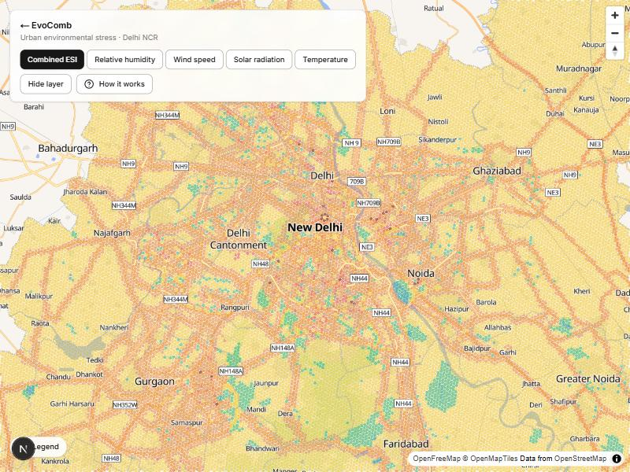
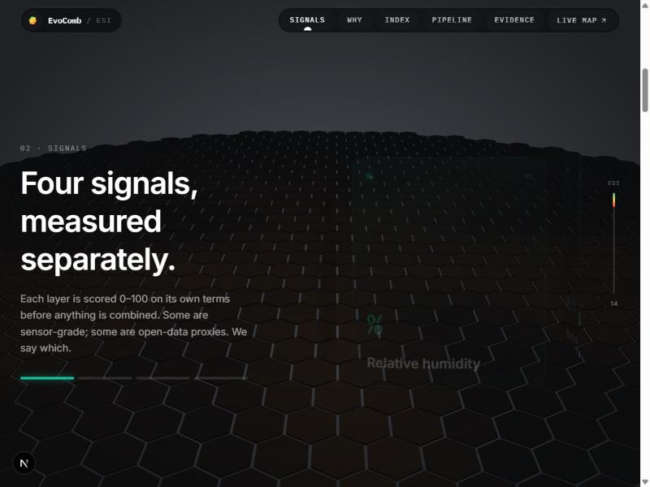

# Hexa-Bytes (EvoComb)

**EvoComb** is an urban **Environmental Stress** mapping platform for **Delhi NCR**. It splits the
region into roughly 53,000 hexagonal cells (Uber H3, resolution 9) and gives each one a 0–100
**Environmental Stress Index (ESI)**, so you can see where the environmental burden on people is
highest.

> "Stress" here means measurable *environmental* burden (heat, air quality, noise, crowding),
> not psychological stress.

## Screenshots

| Live map (`/map`) | Landing page (`/`) |
| --- | --- |
|  |  |
|  |  |

## What it does

- **Landing page** – a scroll-driven 3D story (Three.js, GSAP, Lenis) that explains the signals,
  the index formula, the data pipeline and the evidence, then leads to the map.
- **Live map** – a MapLibre + deck.gl map of Delhi NCR with every hexagon coloured by stress.
  Switch between the **Combined ESI** and individual layers (relative humidity, wind speed,
  solar radiation, temperature), hide the layer, or open the "How it works" explainer.
  Only the hexes inside the current viewport are fetched.
- **Area details & health panel** – click a cell to see its scores. A population-level health-risk
  layer is built on top of the ESI, anchored to published EPA/WHO thresholds; it makes no
  individual predictions.
- **Data pipeline** – the API ingests real data, scores every cell, stores time-bucketed results
  and serves them over a REST API.

## How the index works

The backend is the single source of truth for scoring
([`apps/api/src/app/domain/methodology.py`](apps/api/src/app/domain/methodology.py)). Each input is
normalised to 0–100 and combined as a weighted sum:

```
ESI = 0.30·Noise + 0.25·Density + 0.20·Heat + 0.25·AQI
```

Greenery (parks and forest) acts as a mitigator that lowers a cell's score, and every score carries a
confidence value.

**Known inconsistency:** the frontend currently labels the four signals humidity, wind, solar
radiation and temperature (see `apps/web/src/lib/evocomb/signals.ts`), reusing the same
30/25/20/25 weights, while the backend scores noise, density, heat and AQI. These should be
reconciled.

### Data sources

| Input | Source |
| --- | --- |
| Temperature | MET Norway (plus a modelled urban-heat-island offset) |
| Air quality (AQI) | Open-Meteo, IDW-interpolated |
| Density | OpenStreetMap points of interest |
| Noise | Distance to major OpenStreetMap roads |
| Greenery | OpenStreetMap parks and forest |
| Base map | OpenFreeMap / OpenStreetMap |

## Architecture

```
apps/
  api/   FastAPI + async SQLAlchemy (Python 3.12, uv), Postgres + TimescaleDB + PostGIS, Redis
  web/   Next.js 15 / React 19, MapLibre + deck.gl, Three.js landing page
packages/
  shared-types/   TypeScript contracts (partly generated from the API's OpenAPI schema)
  config/         Shared ESLint and tsconfig
infrastructure/   nginx, database init, MQTT broker config
```

Not built yet: the `/ws` WebSocket is a stub, and the MQTT broker (for IoT sensors) has no consumer.

## Run it locally

**Prerequisites:** Node 22, pnpm 9, Docker.

```bash
# 1. Configure
cp .env.example .env
grep '^NEXT_PUBLIC' .env > apps/web/.env.local   # the web app fails to start without these

# 2. Start the database, Redis and API
docker compose up -d db redis api

# 3. Create the tables (the dev override skips the migration step)
docker compose exec api alembic upgrade head

# 4. Load real data for Delhi NCR (takes a few minutes; allowed while the DB is empty)
curl -X POST http://localhost:8000/api/v1/admin/ingest
curl http://localhost:8000/api/v1/admin/ingest/status   # wait for "state": "done"

# 5. Start the web app
pnpm install
pnpm --filter @platform/web dev
```

Then open:

- Website: <http://localhost:3000>
- Map: <http://localhost:3000/map>
- API docs: <http://localhost:8000/api/v1/docs>

### Useful commands

```bash
pnpm lint && pnpm typecheck && pnpm build     # web checks
cd apps/api && uv run pytest                  # API tests
cd apps/api && uv run ruff check . && uv run mypy src
```

## Deployment

The API and Postgres deploy to Render with the `render.yaml` blueprint. The web app deploys to
Vercel and only needs `NEXT_PUBLIC_API_URL`. A GitHub Action refreshes the data every 6 hours.

## Author

Abhijeet Ranjan ([@Abhi190702](https://github.com/Abhi190702))
